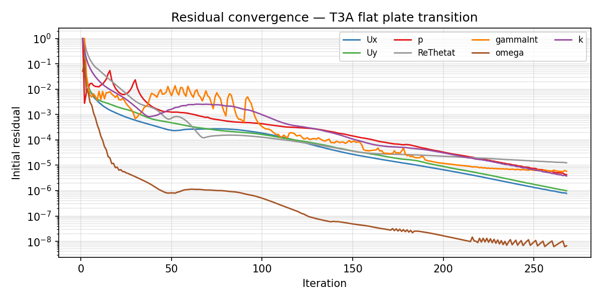
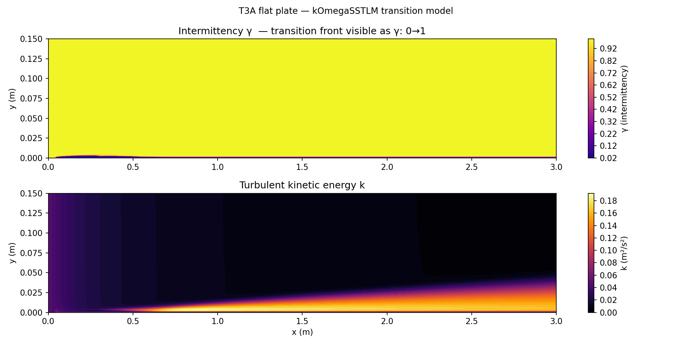
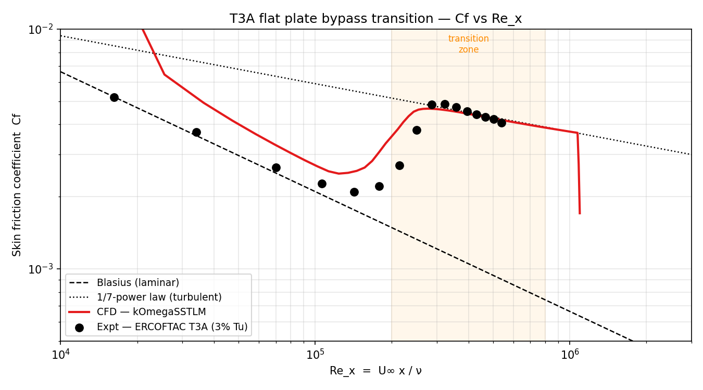
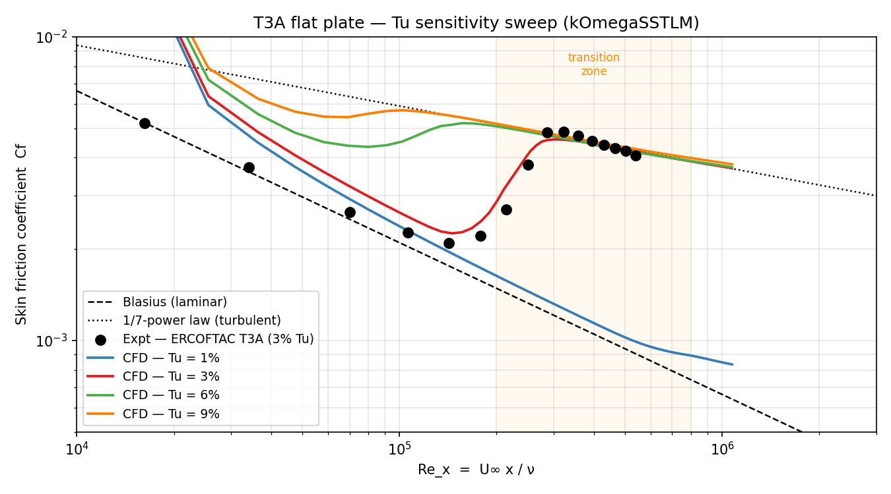
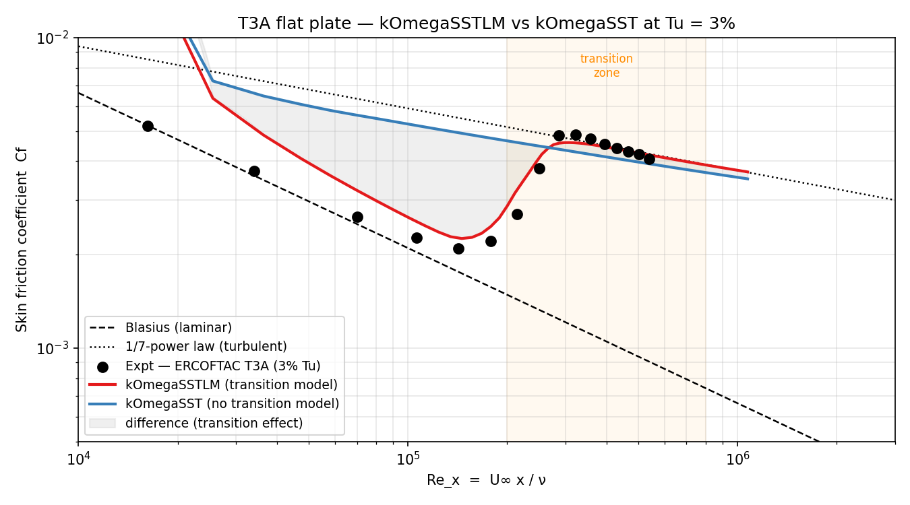

# T3A Flat Plate — Bypass Transition Validation

OpenFOAM 13 RANS simulation of bypass laminar-to-turbulent transition on a flat
plate, validated against the ERCOFTAC T3A benchmark (3% freestream turbulence
intensity). Uses the Langtry-Menter γ-Reθ transition model (`kOmegaSSTLM`).

---

## Physics

Boundary layer transition on a flat plate can happen in several ways. In
**bypass transition** the freestream turbulence intensity is high enough (Tu > ~1%)
that the classical Tollmien-Schlichting wave route is bypassed entirely. Instead,
freestream turbulent fluctuations penetrate the laminar boundary layer and directly
trigger turbulent spots, which spread and merge until the boundary layer is fully
turbulent.

The T3A test case runs at Tu = 3%, which is well into the bypass regime. The key
observable is the skin friction coefficient:

```
Cf = τ_w / (½ ρ U∞²)
```

In the laminar region Cf follows the Blasius solution (Cf ~ Re_x^{-1/2}). Through
transition Cf first drops — the boundary layer thickens but isn't yet turbulent —
then rises sharply as turbulent mixing takes over, before settling onto the
fully-turbulent correlation (Cf ~ Re_x^{-1/5}).

---

## Geometry and mesh

The domain is a flat plate with a blunt leading edge section, modelled as a
structured blockMesh. The plate runs from x = 0.04 m to x = 3.04 m.

| Parameter | Value |
|---|---|
| Plate length | 3.0 m |
| Domain height | 1.0 m |
| Depth (z) | 0.1 m (one cell, effectively 2D) |
| Mesh type | Structured blockMesh with near-wall grading |
| Freestream velocity U∞ | 5.4 m/s |
| Kinematic viscosity ν | 1.5 × 10⁻⁵ m²/s |
| Re_L | ~1.1 × 10⁶ |
| Freestream Tu | 3% |

---

## Turbulence model — kOmegaSSTLM

Standard k-ω SST predicts transition only implicitly through turbulence production
thresholds — it cannot capture the physics of bypass transition. The
**Langtry-Menter γ-Reθ model** (`kOmegaSSTLM`) adds two transport equations on
top of k-ω SST:

| Variable | Meaning |
|---|---|
| γ (gammaInt) | Intermittency — fraction of time the flow is locally turbulent (0 = laminar, 1 = fully turbulent) |
| Re_θt (ReThetat) | Local transition onset momentum-thickness Reynolds number — correlates to freestream Tu |

The intermittency γ acts as a multiplier on the turbulence production term in the
k equation, effectively switching the turbulence model from laminar (γ ≈ 0) to
fully turbulent (γ ≈ 1) across the transition zone. The Re_θt equation carries
freestream Tu information into the boundary layer via a non-local correlation,
allowing the model to predict where transition starts without resolving the
individual turbulent spots.

---

## Results

### Residual convergence

SIMPLE converged in 268 iterations. The γ (gammaInt) residual oscillates through
the transition zone before settling — this is normal behaviour as the intermittency
front sharpens during iteration.



---

### Flow field contours

Turbulent kinetic energy k grows rapidly through the transition zone and spreads
into the boundary layer further downstream. The near-zero k upstream of x ≈ 0.5 m
marks the laminar region; the bright onset and subsequent thickening of the k layer
mark the transition location and the growing turbulent boundary layer.



---

### Validation — Cf vs Re_x

Skin friction coefficient compared against the published ERCOFTAC T3A
experimental data (Savill 1993, 1996).



The CFD correctly captures all three regimes:

- **Laminar (Re_x < ~2 × 10⁵)**: Cf tracks the Blasius solution closely. The
  model is producing near-zero turbulence production in the laminar zone.
- **Transition (2 × 10⁵ < Re_x < 8 × 10⁵)**: Cf dips then rises sharply as
  intermittency ramps from 0 to 1. The onset location and rise rate match the
  experimental scatter well.
- **Turbulent (Re_x > 8 × 10⁵)**: Cf settles onto the turbulent flat-plate
  correlation and tracks the downstream experimental points.

The small Cf over-prediction at the leading edge and slight phase offset in
transition onset are consistent with known limitations of the Langtry-Menter
empirical correlations for Re_θt at moderate Tu.

---

## Study 1 — Freestream turbulence intensity sweep

The same geometry and mesh were run at Tu = 1%, 3%, 6%, and 9% using
`kOmegaSSTLM`. For each case k and ω were set from:

```
k = 1.5 (Tu · U∞)²
ω = k / (ν · μt/μ)        (μt/μ = 12, consistent with the base case)
```

The transition onset Re_θt inlet value was updated using the Langtry-Menter
empirical correlation for zero pressure gradient:

```
Re_θt = 803.73 (Tu + 0.6067)^{-1.027}
```



Transition onset shifts upstream as Tu increases, consistent with bypass
transition physics — higher freestream turbulence penetrates the boundary layer
more aggressively and triggers turbulent spots earlier. At Tu = 1% the boundary
layer remains laminar well past Re_x = 10⁶ before transitioning; at Tu = 9%
transition begins almost immediately from the leading edge. All four cases
collapse onto the same turbulent Cf correlation downstream, confirming that the
fully-turbulent state is independent of how transition was triggered. The Tu = 3%
case matches the ERCOFTAC experimental data best, as expected.

---

## Study 2 — Model comparison: kOmegaSSTLM vs kOmegaSST

Plain k-ω SST was run at Tu = 3% alongside the transition model to quantify the
cost of omitting transition modelling.



Without the γ-Reθ equations, k-ω SST treats the entire boundary layer as fully
turbulent from the leading edge. This produces a Cf curve that:

- **Over-predicts skin friction by 2–3×** through the laminar zone
  (Re_x < 2 × 10⁵), because turbulent mixing is active where the real flow is
  laminar
- **Misses the transition dip entirely** — there is no Cf minimum, no rise, no
  identifiable transition zone
- **Converges onto the correct turbulent Cf** downstream of Re_x ≈ 8 × 10⁵,
  where both models agree and match the data

The shaded region between the two curves is the integrated drag error introduced
by assuming fully-turbulent flow from the leading edge. For aerodynamic surfaces
where transition location controls a significant fraction of total skin friction
drag — turbine blades, aircraft wings at cruise, low-Re UAV configurations — this
error is not acceptable and a transition-aware model is required.

---

## Running the case

```bash
source /opt/openfoam13/etc/bashrc

blockMesh
foamRun
foamToVTK -latestTime

python3 postprocess.py
```

Or use the provided `Allrun` script:

```bash
./Allrun
```

### Studies

```bash
cd studies
# cases are pre-run; to re-run:
for case in Tu1 Tu3 Tu6 Tu9 kOmegaSST_Tu3; do
    cd $case && blockMesh && foamRun && cd ..
done
python3 plot_studies.py
```

---

## References

Savill, A.M. (1993). *Some recent progress in the turbulence modelling of
by-pass transition*. Near-wall turbulent flows, 829–848.

Savill, A.M. (1996). *One-point closures applied to transition*. In Turbulence
and transition modelling, Springer Netherlands, 233–268.

Langtry, R.B. and Menter, F.R. (2009). *Correlation-based transition modeling
for unstructured parallelized computational fluid dynamics codes*. AIAA Journal,
**47**(12), 2894–2906.
